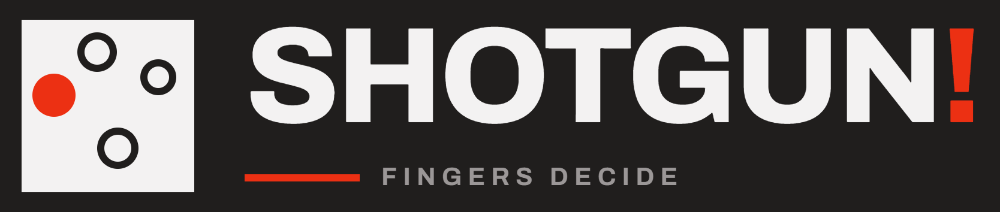

# Shotgun!

[](https://github.com/drehtuer/ShotgunApp/actions/workflows/pr.yml)
[](https://github.com/drehtuer/ShotgunApp/actions/workflows/codeql.yml)
[](https://github.com/drehtuer/ShotgunApp/actions/workflows/docs.yml)
[](https://github.com/drehtuer/ShotgunApp/actions/workflows/release.yml)
[](https://github.com/drehtuer/ShotgunApp/releases/latest)
[](https://github.com/drehtuer/ShotgunApp/blob/main/.github/dependabot.yml)
[](https://github.com/drehtuer/ShotgunApp/blob/main/LICENSE)
[](https://sonarcloud.io/component_measures?id=drehtuer_ShotgunApp&metric=line_coverage)
[](https://sonarcloud.io/component_measures?id=drehtuer_ShotgunApp&metric=branch_coverage)

An Android app for settling *who goes first*. Everyone puts a finger on the
screen, a countdown runs, and the app draws — a starting player, a full player
order, or teams.

The mark is the game itself: four fingers on the glass, one of them called -
specified in [`design/Shotgun Logo.dc.html`](https://github.com/drehtuer/ShotgunApp/blob/main/design/Shotgun%20Logo.dc.html),
with rendered assets in [`assets/logo/`](https://github.com/drehtuer/ShotgunApp/tree/main/assets/logo).

The design lives in [`design/Shotgun.dc.html`](https://github.com/drehtuer/ShotgunApp/blob/main/design/Shotgun.dc.html),
exported from a Claude Design project. It is the spec for this implementation:
screens, copy, palette and interaction behaviour all come from there.
`design/_ds/` is the bound copy of the **Modernist** design system the export
was built against.

## Status

**Built, verified on the phone, and released.** Seven rounds of device feedback
settled the countdown default, the reveal timing, the dim level and the haptics.
`v0.1.2` is published and the documentation site is live at
[drehtuer.github.io/ShotgunApp](https://drehtuer.github.io/ShotgunApp/). What
remains is a fourth draw mode - COLOURS, blocked on one decision - and the
polish listed in [`docs/TODO.md`](docs/TODO.md).

| Piece | State |
| --- | --- |
| Gradle project, Compose setup | done |
| Modernist theme: colour, type, dimensions | done |
| Navigation shell across all four screens | done |
| Appearance setting (system / light / dark) | done |
| Home: mode cards, team stepper | done |
| Draw surface: multi-touch, countdown, reveal | done, verified on the phone |
| Result: fairness heatmap | done |
| Settings: haptics, dim, countdown, timing | done |
| Draw history database | done |
| Identity: name, logo, launcher icon | done |
| Settings persistence | done |

## Design tokens

The `--pp-*` custom properties from the export are transcribed into
[`ui/theme/Color.kt`](https://github.com/drehtuer/ShotgunApp/blob/main/app/src/main/java/de/drehtuer/shotgun/ui/theme/Color.kt)
as a `PPColors` palette, with light and dark variants, the team ring fills and
the heatmap ramp. Type roles from the design (wordmark, display, card title, micro
label…) are in [`Type.kt`](https://github.com/drehtuer/ShotgunApp/blob/main/app/src/main/java/de/drehtuer/shotgun/ui/theme/Type.kt);
Archivo ships bundled in `res/font`.

Read them through `PPTheme`:

```kotlin
Text(
    text = "SHOTGUN!",
    style = PPTheme.typography.wordmark,
    color = PPTheme.colors.ink,
)
```

Modernist rules that the theme encodes: **zero corner radius**, **2px rules**
(`PPTheme.dimens.rule`) doing the organising, and everything set in Archivo.

## Development

The repo ships a devcontainer with the Android SDK, an emulator and
`platform-tools`. Open the folder in VS Code and *Reopen in Container*; the
first create downloads the SDK packages (~1–2 GB) into a named volume, so later
rebuilds are fast.

```bash
./gradlew assembleDebug          # debug build: debuggable, unminified
./gradlew assembleRelease        # release build: R8, shrunk, symbols stripped
./gradlew testDebugUnitTest      # unit tests
./gradlew lint                   # static analysis
./gradlew installDebug           # install on the connected device
```

Signing keys are **never committed** - this repository is public. See
[`docs/build-environment.md`](docs/build-environment.md#signing).

Contributor workflow, testing rules and the emulator/device recipes are in
[`.claude/CLAUDE.md`](https://github.com/drehtuer/ShotgunApp/blob/main/.claude/CLAUDE.md).

### Emulator

```bash
./.devcontainer/emulator-start.sh        # boots pixel9a-api37 headless
```

The AVD targets **API 37 (Android 17)** on a `pixel_9a` profile, matching the
target phone's OS version. The Pixel 10a has no profile in the emulator's device
catalogue yet, so `pixel_9a` is the closest hardware match.

The container gets `/dev/kvm` for hardware acceleration.

### A real device over Wi-Fi

The emulator cannot test multi-touch, so the draw surface needs a real phone.
The container uses bridge networking, and `adb connect` is outbound, so this
works without host networking.

```bash
# Android 11+: Developer options > Wireless debugging > Pair device with code
./.devcontainer/connect-device.sh pair 192.168.1.42:41234 123456
./.devcontainer/connect-device.sh connect 192.168.1.42:43227

./gradlew installDebug
```

On Android 11+ the connect port is a **random port, not 5555**, and it differs
from the pairing port. If the phone is not to hand,
`./.devcontainer/connect-device.sh discover 192.168.1.42` finds it.

Run `./.devcontainer/connect-device.sh` with no arguments for the full notes,
including the older `adb tcpip 5555` route.

## Documentation

| Document | What it covers |
| --- | --- |
| [`docs/design.md`](docs/design.md) | The design in Markdown: tokens, screens, state model, behaviour |
| [`docs/architecture.md`](docs/architecture.md) | How the app is put together: layers, screen graph, state machines |
| [`docs/build-environment.md`](docs/build-environment.md) | Building, testing, emulator and device, CI, troubleshooting |
| [`docs/TODO.md`](docs/TODO.md) | Open work and the decisions that block it |
| [`docs/STATUS.md`](docs/STATUS.md) | What has been done and how it turned out |
| [`.claude/CLAUDE.md`](https://github.com/drehtuer/ShotgunApp/blob/main/.claude/CLAUDE.md) | Working rules: branching, testing, keeping docs in sync |
| [`SECURITY.md`](https://github.com/drehtuer/ShotgunApp/blob/main/SECURITY.md) | Reporting a vulnerability, and what the app can actually do |

The design sources these are derived from:

| Source | What it is |
| --- | --- |
| [`design/Shotgun.dc.html`](https://github.com/drehtuer/ShotgunApp/blob/main/design/Shotgun.dc.html) | The app design and its state machine - the spec |
| [`design/Shotgun Logo.dc.html`](https://github.com/drehtuer/ShotgunApp/blob/main/design/Shotgun%20Logo.dc.html) | The identity: mark geometry, wordmark, brand don'ts |
| [`design/_ds/…/readme.md`](https://github.com/drehtuer/ShotgunApp/blob/main/design/_ds/modernist-f7022762-4cb9-409e-a6ce-7116795bae5b/readme.md) | Modernist's own guide, from the bound design system |

Documentation is kept in sync with the implementation - see
[`.claude/CLAUDE.md`](https://github.com/drehtuer/ShotgunApp/blob/main/.claude/CLAUDE.md).

## Continuous integration

| Workflow | Runs on | Does |
| --- | --- | --- |
| [`pr.yml`](https://github.com/drehtuer/ShotgunApp/blob/main/.github/workflows/pr.yml) | any PR, push to `main` | builds debug, then unit tests and Android Lint |
| [`release.yml`](https://github.com/drehtuer/ShotgunApp/blob/main/.github/workflows/release.yml) | a `v*` tag only | builds and signs the APK and AAB, drafts the release with them, then publishes it |
| [`docs.yml`](https://github.com/drehtuer/ShotgunApp/blob/main/.github/workflows/docs.yml) | a `v*` tag, manual | builds the GitHub Pages site with Jekyll (these documents + Dokka API docs) |
| [`codeql.yml`](https://github.com/drehtuer/ShotgunApp/blob/main/.github/workflows/codeql.yml) | any PR, push to `main`, weekly | CodeQL over the Kotlin sources and the workflows |

Reports are uploaded as artifacts, including on failure.

## Layout

```
app/           the Android app
assets/logo/   rendered logo assets
assets/css/    the documentation site's stylesheet
design/        the Claude Design export (the spec) + bound Modernist system
docs/          documentation
_config.yml    GitHub Pages (Jekyll) configuration
_layouts/      the documentation site's page layout
.devcontainer/ Android SDK, emulator and adb helpers

app/src/main/java/de/drehtuer/shotgun/
  MainActivity.kt
  data/
    local/       Room: the draw history database and its DAO
    settings/    DataStore: the persisted settings
  draw/          DrawEngine - the draw rules, with no Android in them
  result/        HeatField - the fairness field's density maths
  ui/
    theme/       PPColors, PPTypography, PPDimens, ShotgunTheme
    navigation/  Destination, DrawMode, ShotgunNavHost
    components/  Rule, ScreenHeader, NotBuiltYet, ShotgunWordmark
    screens/     Home, Draw, Result, Settings
    util/        KeepScreenOn, DimMode, findActivity

app/src/test/        JVM unit tests
app/src/androidTest/ instrumented tests (emulator or phone)
```

The documentation site is published from this Markdown, unchanged - see
[`docs/build-environment.md`](docs/build-environment.md#the-documentation-site).

## Requirements

- minSdk 26, compileSdk / targetSdk 37 (Android 17)
- AGP 9.4.0 on Gradle 9.7.1, JDK 21. AGP 9 has built-in Kotlin support, so
  there is deliberately **no `kotlin-android` plugin** - applying it fails.
- Portrait only, and a touchscreen with distinct multi-touch

Target device: **Pixel 10a running Android 17** (API 37), confirmed - so the
app targets the device's own API level exactly. Verified building and running on
an API 37 emulator; multi-touch still needs the real phone.

## Licence

**GNU General Public License, version 2 or later**
(`SPDX-License-Identifier: GPL-2.0-or-later`) - the full text of version 2 is
in [`LICENSE`](https://github.com/drehtuer/ShotgunApp/blob/main/LICENSE).

```
Copyright (C) 2026 drehtuer

This program is free software; you can redistribute it and/or modify it under
the terms of the GNU General Public License as published by the Free Software
Foundation; either version 2 of the License, or (at your option) any later
version.

This program is distributed in the hope that it will be useful, but WITHOUT ANY
WARRANTY; without even the implied warranty of MERCHANTABILITY or FITNESS FOR A
PARTICULAR PURPOSE.  See the GNU General Public License for more details.
```

The design sources under `design/` are exports from a Claude Design project and
the bound **Modernist** design system; they are included as the specification
this app is built from, not as GPL'd source.

> **Why "or later".** Every runtime dependency here - AndroidX, Compose, Room,
> DataStore, the Kotlin and kotlinx libraries - is under **Apache License 2.0**,
> which the Free Software Foundation considers *incompatible with GPLv2*: its
> patent-termination clause is an added restriction GPLv2 does not permit.
> Apache 2.0 **is** compatible with GPLv3, so the "or later" clause is what
> resolves it - a recipient may take the work under GPLv3 terms, where the
> conflict does not arise. Under GPL-2.0-only it would.
