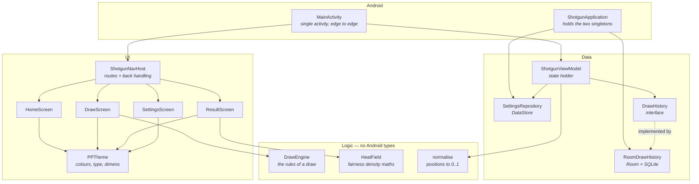
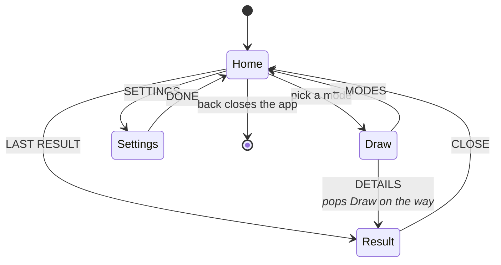
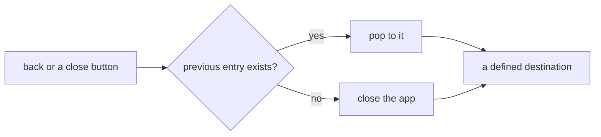
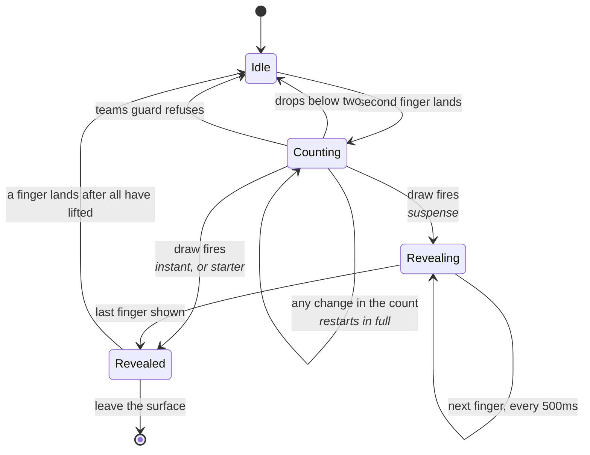
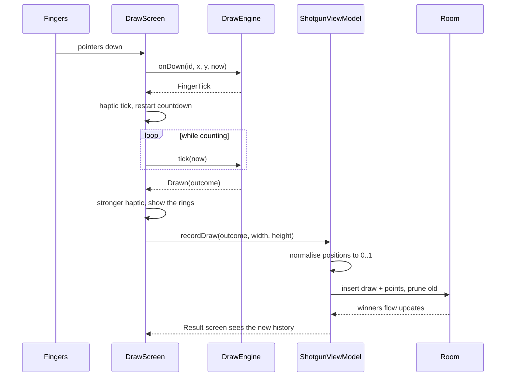

# Architecture

How Shotgun! is put together, and why. For *what* it does, see
[`design.md`](design.md); for how to build it,
[`build-environment.md`](build-environment.md).

## The shape of it

A single activity hosting Compose, four screens behind one navigation graph, and
two stores underneath. There is no dependency injection framework: the app has
two dependencies, and a container with two `by lazy` properties says so more
plainly than a graph would.

**The arrows only point one way.** Logic never imports Android, the data layer
never imports the UI, and the screens never reach past the ViewModel. That is
what makes `DrawEngine` and `HeatField` unit-testable, which matters because the
things they get wrong - an unfair draw, a misleading fairness field - are
invisible on screen.

## Screens

Two deliberate details:

- **`Draw → Result` pops the draw surface.** Otherwise closing the result drops
  you back into another round of the same mode, which is not what finishing a
  draw should do.
- **Back on Home closes the app.** All back handling lives in one place in
  `ShotgunNavHost` rather than being left to the NavHost's own handler racing
  anything else.

### Why the graph can never be empty

A blank window - alive, resumed, drawing nothing - is unrecoverable without a
restart, and it is what happens if the back stack is ever popped empty. Two pops
racing each other are enough: a button tapped twice, or a tap arriving together
with the back gesture.

So **every exit path goes through `popSafely()`**, which pops only when there is
something underneath, and navigation goes through `navigateOnce()`, which
refuses to navigate from a screen that is already leaving.

`NavigationStateTest` hammers this: over-popping, navigate-then-pop in the same
frame, and repeated navigation all assert that a destination still exists.

## The draw

`DrawEngine` holds the rules with time passed in and randomness injected, so
every one of them is testable without a screen. `DrawScreen` owns only what
cannot be: pointers, drawing and haptics.

The countdown is a **settling time**, not a fixed delay: any change in the number
of fingers puts the whole thing back on the clock. Moving a finger is not a
change in the count and does not restart it.

**The result outlives the fingers.** You have to lift your hand to see what is
under it, so once revealed the rings are drawn from the recorded outcome rather
than from live pointers.

### A draw, end to end

Positions are **normalised at the point of writing**, never stored as pixels.
That is the one thing in this layer that corrupts data silently: the fairness
field plots every draw ever made, so a record written on one screen size has to
still mean the same thing on another.

**What a ring looks like is decided outside the composable.** `ringSpec` in the
Logic layer maps a finger, an outcome and a phase onto a `RingSpec` - a role,
an alpha, a scale, a label - and `DrawScreen` only turns that role into a
colour. The rules it encodes are real decisions (who is dimmed, what is
emphasised, which letter a team gets past Z) and used to be unreachable inside
a composable. Label placement went the same way: `labelFitsAbove` and
`labelOffsetY` are pure.

**The fairness field is rasterised off the main thread.** `HeatField` splats a
kernel per retained winner, so the cost grows with history - and the screen is
entered exactly when that history is largest. `ResultScreen` runs it in a
`produceState` on `Dispatchers.Default`, keyed on the winners, the palette and
the panel size; the previously rendered bitmap stays up until the new one
arrives, so a recompute shows a stale field rather than an empty panel. The
maths itself stays in the Logic layer, free of Android types and unit-tested.

## Timing, and a trap in it

Two timers run on the draw surface: the countdown, and the reveal walking down
the order. Both are keyed on the **phase**, never on a counter that pointer
movement bumps.

That distinction is not cosmetic. Keying them on a revision counter is the
obvious implementation and it fails in a way no emulator shows: a hand resting
on glass jitters continuously, every move bumps the counter, and both timers are
cancelled and restarted before they can finish. Nothing resolves until the
fingers come off.

## State ownership

| State | Lives in | Survives |
| --- | --- | --- |
| Settings | DataStore, via `SettingsRepository` | process death |

`SettingsRepository` takes the `DataStore` rather than opening one from a
`Context`. The app passes the context and gets the process-wide store as
before; tests pass their own, because that singleton is shared by every test
in the JVM - see *Testing* in
[`build-environment.md`](build-environment.md#the-settings-store-is-a-singleton-so-tests-are-given-their-own).
| Draw history | Room, via `DrawHistory` | process death |
| Team count | `ShotgunViewModel` | navigation, not process death |
| Draw in progress | `DrawEngine`, remembered by `DrawScreen` | nothing - a draw is of the moment |
| Screen | `NavHostController` | configuration change |

Team count is deliberately *not* persisted: the design keeps it beside the draw
rather than among the preferences, so it resets with the app the way the mode
does.

## Testing seams

The architecture exists mostly to make the risky parts testable.

| Layer | Tested by | Why there |
| --- | --- | --- |
| `DrawEngine`, `HeatField`, `ringSpec`, `normalise`, settings | JVM unit tests | Pure - no device needed, and these are where silent wrongness lives |
| Screens, navigation, theme | Robolectric, also on the JVM | The framework without a device: that a screen composes, lays out and responds |
| Multi-touch, Room queries, navigation, controls | Instrumented tests | Only real against a framework |
| Feel: timing, haptic strength, legibility under a hand | A person, on a phone | No test can judge it |

The last row is not a gap to be closed. It is why every change to the draw
surface is checked on the device before it is called done.
